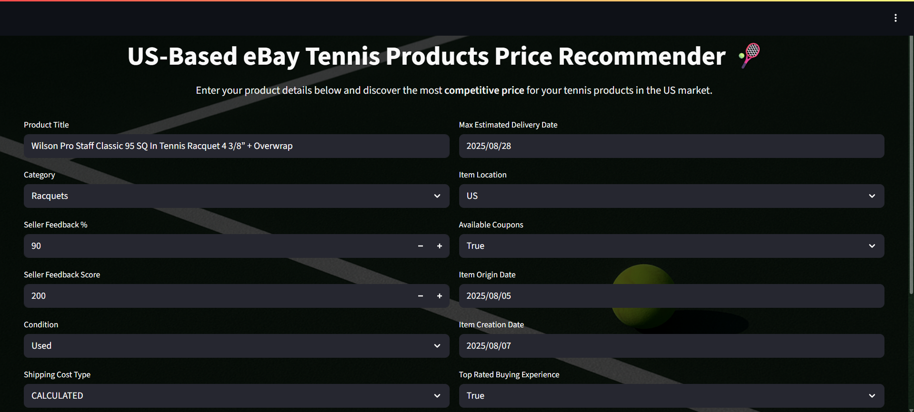
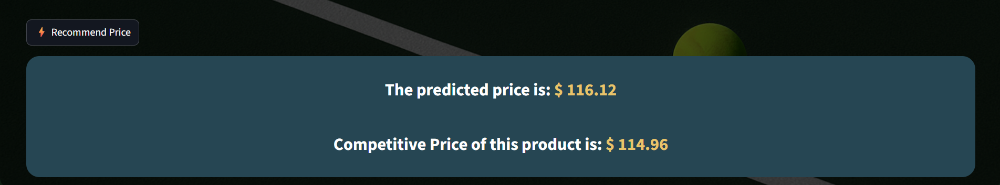
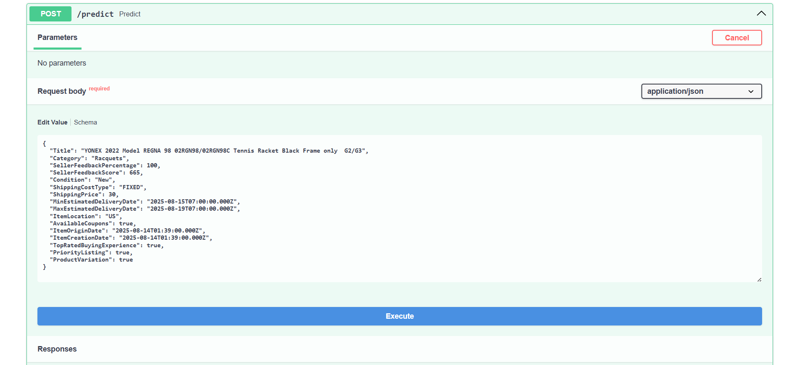
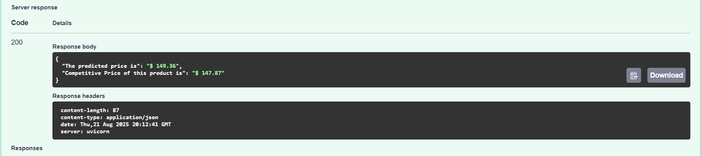

# 🎾 Ebay Tennis Products Price Recommender System  

This project predicts prices of tennis-related products listed on Ebay by combining real-time market data, trend signals, and advanced machine learning models.  


  
*Streamlit app showing product price recommendations.* 

  
  
*FastAPI showing product price recommendations.* 

It is built as an **end-to-end system**:  
- Data collection from APIs and scraping  
- Feature engineering and ML pipeline training  
- FastAPI backend with Pydantic validation  
- Streamlit frontend for user interaction  
- Dockerized with `docker-compose`  
- Deployed on **AWS EC2**

Medium Link: [Building an End-to-End Tennis Product Price Recommender System with Machine Learning, FastAPI, Streamlit, Docker and AWS](https://medium.com/@shaikhahmedfaraz64/building-an-end-to-end-tennis-product-price-recommender-system-with-machine-learning-fastapi-a8f93d8125af)

---

## 🚀 Features  

- **Data Sources**  
  - Ebay Developers API  
  - PyTrends (Google Trends)  
  - SofaScore (via Selenium scraping)  

- **Machine Learning**  
  - Preprocessing and feature engineering pipeline  
  - Voting Regressor combining: Ridge, Lasso, ElasticNet, LinearSVR, SVR (RBF), KNeighbors, AdaBoost, GradientBoosting, HistGradientBoosting, XGBoost, CatBoost, LightGBM  
  - Model tuning and evaluation  
  - Final pipeline serialized with Pickle  

- **Application**  
  - **Backend**: FastAPI REST API serving model predictions  
  - **Frontend**: Streamlit interface for users to input product details and view recommended prices  
  - **Deployment**: Docker Compose for containerization, AWS EC2 for hosting  

---

## 🛠 Tech Stack  

- **Languages**: Python  
- **ML Libraries**: Scikit-learn, XGBoost, CatBoost, LightGBM  
- **Data Tools**: Pandas, NumPy, PyTrends, Selenium  
- **Web Frameworks**: FastAPI, Streamlit  
- **Infra**: Docker, Docker Compose, AWS EC2  

---

## 📂 Project Structure  
``` bash
ebay_tennis_products_price_recommender/
├── .gitignore
├── backend
    ├── Dockerfile
    ├── app.py
    ├── data_code
    │   ├── sofascore.py
    │   ├── sofascore_data
    │   │   ├── avg_home_score_df.csv
    │   │   └── avg_user_count_df.csv
    │   ├── trend_data
    │   │   ├── trend_scores_2025-08-14 04_53_17.234811.csv
    │   │   ├── trend_scores_2025-08-14 05_05_45.385225.csv
    │   │   ├── trend_scores_2025-08-14 05_22_56.935681.csv
    │   │   ├── trend_scores_2025-08-14 05_40_42.917833.csv
    │   │   └── trend_scores_2025-08-14 06_01_38.034954.csv
    │   └── trends.py
    ├── model
    │   ├── predict.py
    │   └── tempCodeRunnerFile.py
    ├── pipeline_code
    │   ├── feature_combination.py
    │   ├── select_dtypes.py
    │   └── transformed_target_regressor.py
    └── schema
    │   └── input_data.py
├── docker-compose.yml
├── frontend
    ├── Dockerfile
    ├── ebay.py
    ├── ebay_data
    │   └── ebay_list_data.csv
    ├── frontend.py
    └── tennis.png
├── notebook
    ├── data
    │   ├── avg_home_score_df.csv
    │   ├── avg_user_count_df.csv
    │   ├── ebay_list_data.csv
    │   ├── ebay_product_price.csv
    │   ├── ebay_tennis_data.csv
    │   ├── sofascore_data_df.csv
    │   ├── trend_scores_2025-08-14 04_53_17.234811.csv
    │   ├── trend_scores_2025-08-14 05_05_45.385225.csv
    │   ├── trend_scores_2025-08-14 05_22_56.935681.csv
    │   ├── trend_scores_2025-08-14 05_40_42.917833.csv
    │   └── trend_scores_2025-08-14 06_01_38.034954.csv
    ├── ebay_product_price_recommendation.ipynb
    └── pipeline_code
    │   ├── feature_combination.py
    │   ├── select_dtypes.py
    │   └── transformed_target_regressor.py
└── requirements.txt
```
---

## ⚡ Quick Start  

### 🔹 Run with Docker (Recommended)  

1. Clone the repository:
   
   ```bash
   git clone https://github.com/ahmedfarazsyk/ebay_tennis_products_price_recommender.git
   cd ebay_tennis_products_price_recommender
   
3. Pull images from Docker Hub:
   
   ```bash
    docker pull ahmedfarazsyk/ebay_product_price_recommender-backend
    docker pull ahmedfarazsyk/ebay_product_price_recommender-frontend

4. Start containers with Docker Compose:
   
   ```bash
    docker-compose up

6. Access the apps:
  FastAPI docs → http://localhost:8000
  Streamlit UI → http://localhost:8501

### 🔹 Run Manually (Without Docker)

1. Backend (FastAPI)
   
``` bash
    cd backend
    pip install -r requirements.txt
    uvicorn app:app --reload
```

2. Frontend (Streamlit)
   
    ```bash
    cd frontend
    pip install -r requirements.txt
    streamlit run app.py

### 🌍 Live Demo

  FastAPI Backend: http://52.201.206.176:8000/
  Streamlit Frontend: http://52.201.206.176:8501/

---

## 🔮 Future Improvements

- Automate data collection (scheduled pipeline)

- Real-time model retraining

- CI/CD with GitHub Actions

---

## 👤 Author

- Ahmed Faraz Shaikh

- GitHub: ahmedfarazsyk

- Docker Hub: ahmedfarazsyk
